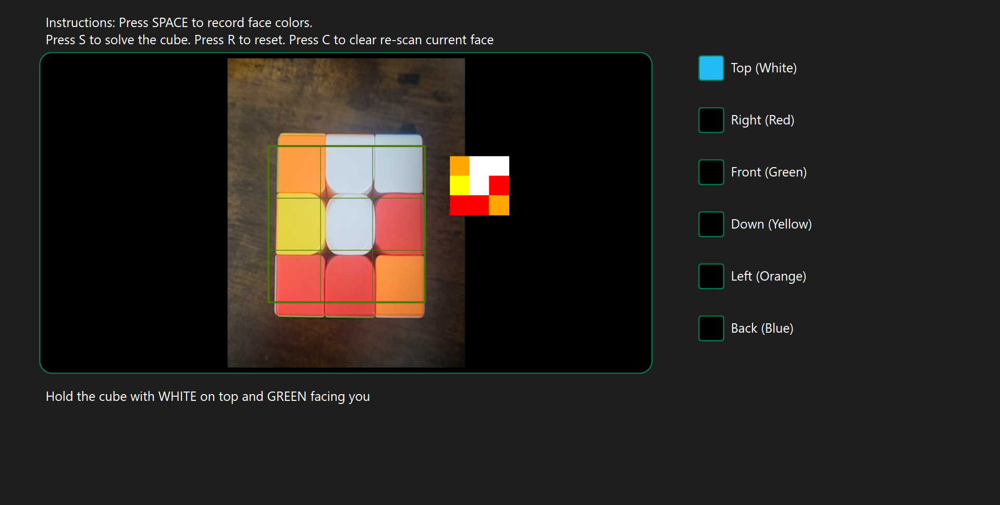
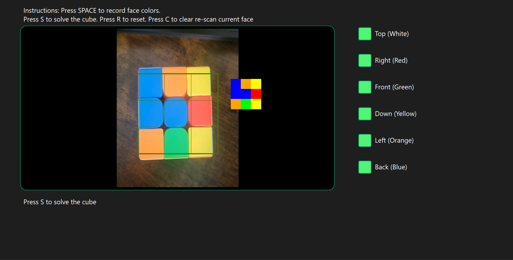
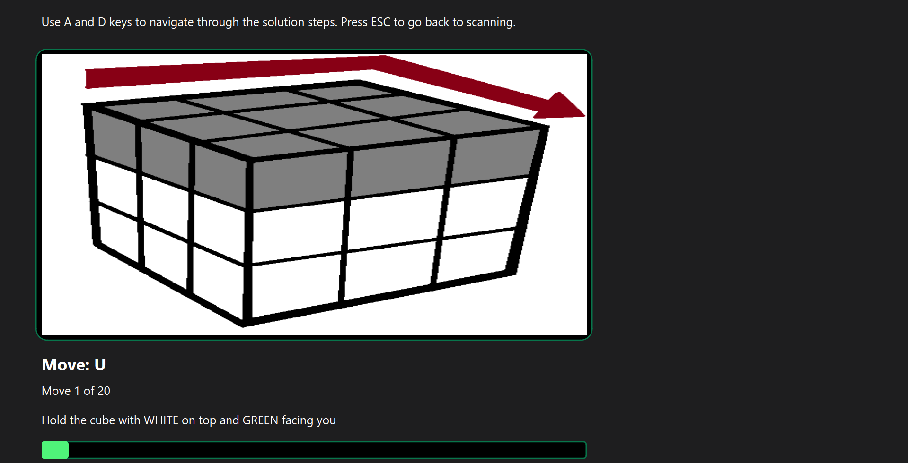
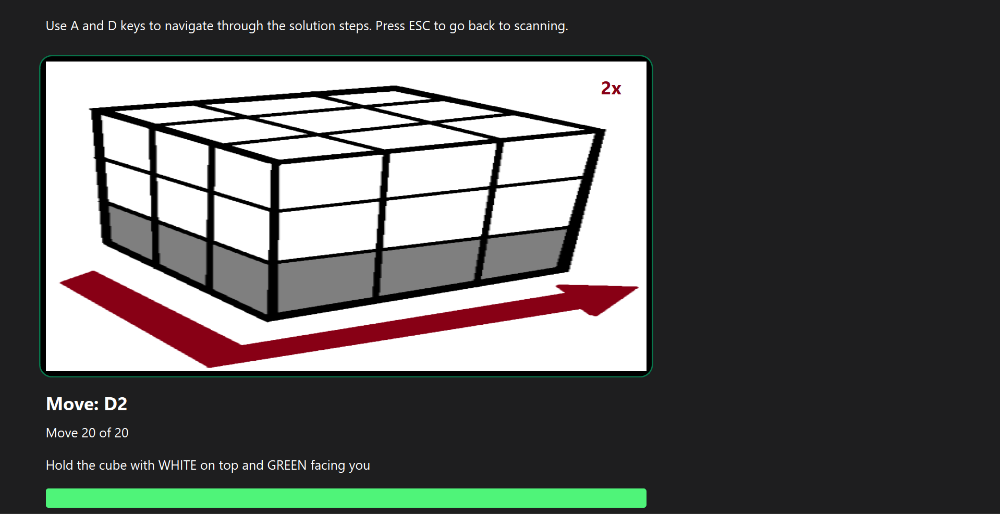

# Rubik's cube solver

A computer vision application that scans a physical Rubik's Cube using a camera and generates a step-by-step visual solution.

This project combines real-time image processing with the Kociemba algorithm to compute optimal solving moves.

## Features
- Real-time color detection using openCV
- Full cube scanning (all 6 faces)
- Re-scan entire cube or recent scanned face
- Step-by-step solution visualization
- Progress tracking
- Keyboard-controlled navigation

## Technologies
- **Python**
- **PyQt6 (GUI)**
- **OpenCV (Computer Vision)**
- **NumPy**
- **Kociemba Algorithm (Solving the cube)**

## Installation
```bash
pip install PyQt6 opencv-python numpy kociemba
```
## Usage
1. Run `python rubics_cube_solver.py`
2. Scan each face of the cube following on-screen instructions
3. Press S to solve
4. Press A/D keys to navigate through the solution moves

## Pictures




